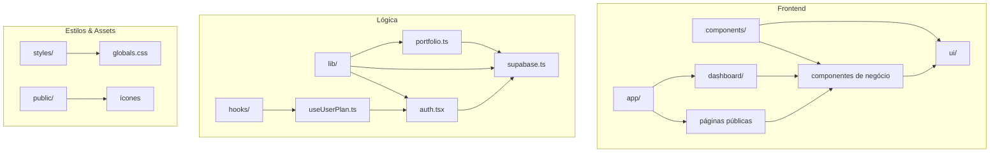

# Fino Web - Resumo da Arquitetura

## 📁 Árvore de Diretórios (até 3 níveis)

```
afino-web/
├── app/ (10 arquivos + 7 subdirs)
│   ├── dashboard/ (1 arquivo + 6 subdirs)
│   │   ├── accounts/ (1 arquivo + 1 subdir)
│   │   │   └── new/ (1 arquivo)
│   │   ├── assets/ (1 arquivo + 1 subdir)
│   │   │   └── new/ (1 arquivo)
│   │   ├── events/ (1 arquivo + 1 subdir)
│   │   │   └── new/ (1 arquivo)
│   │   ├── portfolio/ (1 arquivo)
│   │   ├── reports/ (1 arquivo)
│   │   └── settings/ (1 arquivo)
│   ├── about/ (1 arquivo)
│   ├── contact/ (1 arquivo)
│   ├── demo/ (1 arquivo)
│   ├── features/ (1 arquivo)
│   ├── login/ (1 arquivo)
│   ├── pricing/ (1 arquivo)
│   └── signup/ (1 arquivo)
├── components/ (17 arquivos + 1 subdir)
│   └── ui/ (14 arquivos)
├── lib/ (4 arquivos)
├── hooks/ (1 arquivo)
├── public/ (3 arquivos)
├── styles/ (2 arquivos)
├── database/ (vazio)
└── docs/ (1 arquivo + 1 subdir)
    └── summary/ (1 arquivo)
```

**Contagem por pasta:**
- `app/`: 10 arquivos + 7 subdiretórios
- `components/`: 17 arquivos + 1 subdiretório
- `components/ui/`: 14 arquivos
- `lib/`: 4 arquivos
- `hooks/`: 1 arquivo
- `public/`: 3 arquivos
- `styles/`: 2 arquivos
- `database/`: 0 arquivos
- `docs/`: 1 arquivo + 1 subdiretório

## 🏗️ Principais Camadas da Aplicação

### 1. **UI/Components** (`/components/`)
- **Componentes de UI Base**: 14 componentes em `/components/ui/` (button, card, dialog, form, etc.)
- **Componentes de Negócio**: 17 componentes específicos (Header, Footer, PortfolioChart, etc.)
- **Sistema de Design**: Baseado em shadcn/ui com Tailwind CSS

### 2. **App Router** (`/app/`)
- **Páginas Públicas**: about, contact, demo, features, login, pricing, signup
- **Dashboard**: Sistema completo com 6 módulos (accounts, assets, events, portfolio, reports, settings)
- **Layout**: Estrutura principal da aplicação
- **Server Components**: Maioria das páginas são Server Components

### 3. **Bibliotecas** (`/lib/`)
- **Autenticação**: `auth.tsx` - Sistema de autenticação
- **Banco de Dados**: `supabase.ts` - Cliente Supabase
- **Portfólio**: `portfolio.ts` - Lógica de negócio para portfólio
- **Utilitários**: `utils.ts` - Funções auxiliares

### 4. **Hooks** (`/hooks/`)
- **useUserPlan**: Hook para gerenciamento de planos do usuário

### 5. **Estilos** (`/styles/`)
- **CSS Global**: `globals.css` - Estilos globais da aplicação
- **Tailwind**: Configuração via `tailwind.config.js`

### 6. **Assets** (`/public/`)
- **Ícones**: SVG e PNG para a aplicação
- **Favicon**: Ícone do site

## 🔄 Diagrama de Módulos



## 📊 Estatísticas do Projeto

- **Total de arquivos TypeScript/TSX**: ~50
- **Total de páginas**: 15 (incluindo subpáginas do dashboard)
- **Componentes UI**: 14 base + 17 específicos
- **Hooks customizados**: 1
- **Bibliotecas principais**: 4
- **Arquivos de configuração**: 8

## 🎯 Tecnologias Principais

- **Framework**: Next.js 14 (App Router)
- **Linguagem**: TypeScript
- **Estilização**: Tailwind CSS + shadcn/ui
- **Backend**: Supabase (autenticação + banco)
- **Deploy**: Vercel (presumido)

---

*Este resumo serve como índice para a documentação completa do projeto Fino Web.* 